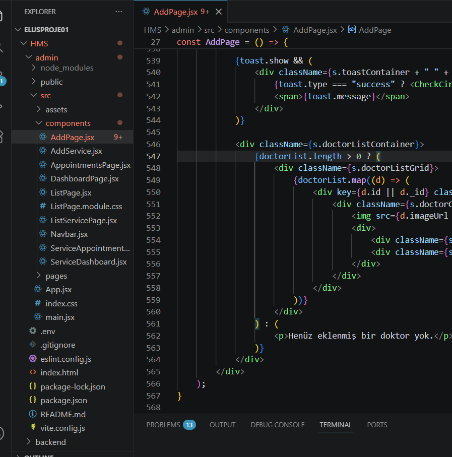

# Proje Klasör Yapısı Okuma

Gelişmiş yazılım projelerinde kodların nasıl organize edildiğini inceledim. `src`, `public`, `controllers`, `models`, `components` gibi standart klasörlerin görevlerini ve proje mimarisindeki yerlerini öğrendim. Bu sayede karmaşık projelerde aradığım kod bloğunu daha hızlı bulabiliyorum.
Ek olarak ekran görüntüsü paylaştım daha önce yaptığım bi projede proje klasör yapısı okumayı tekrarladım.
